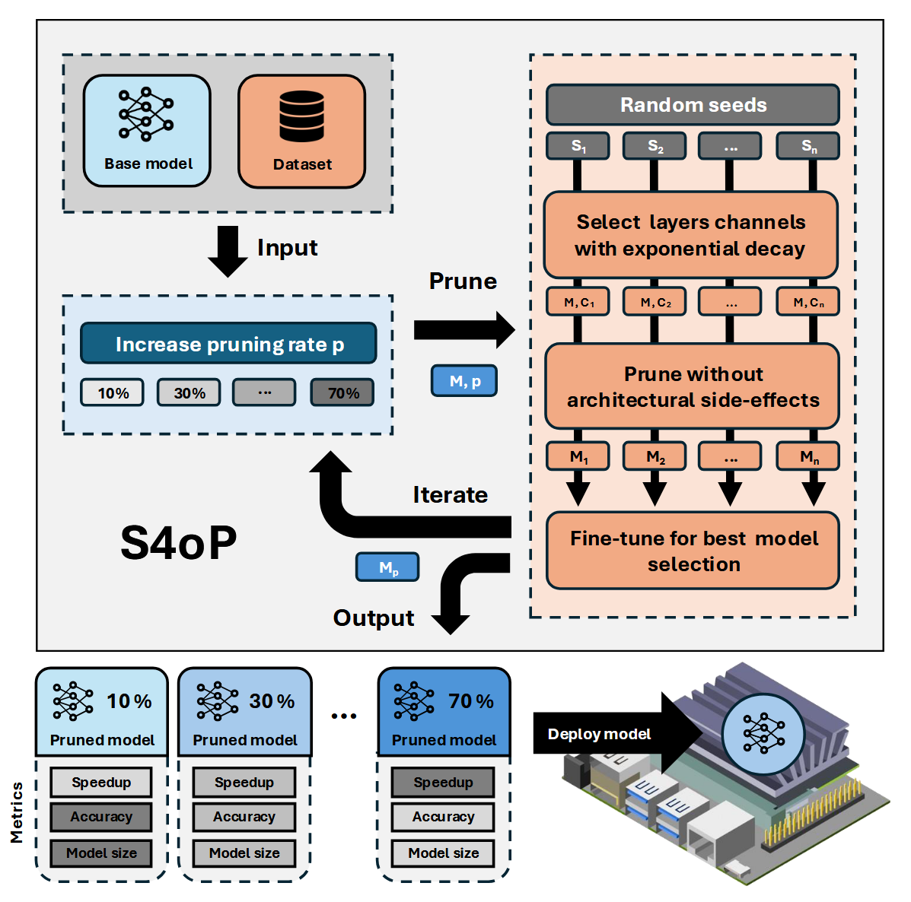

# S4oP: Operator-level Pruning of State Space Models

[](https://arxiv.org/abs/2606.18096)

Official implementation of **"[S4oP: Operator-level Pruning of Structured State Space Models for Resource-Constrained Devices](https://arxiv.org/abs/2606.18096)"**, presented at **IFIP/IEEE VLSI-SoC 2026**.

S4oP is a framework to **train, test, and prune S4 and S4D models** for efficient inference on resource-constrained devices. Instead of sparsifying individual weights, S4oP removes entire SSM operators (channels), so the pruned models are genuinely faster on real hardware, without relying on sparse kernels.

> **Work in progress.** The repository also contains code for Mamba, Mamba2, and genomic benchmarks. This code is still being refined: it is not part of the published results, and further experiments are ongoing. See [Work in progress](#work-in-progress) for details.

## How it works

- **Operator-level pruning.** In S4 and S4D, each channel is an independent SSM operator running in parallel. A pruned channel is bypassed by forwarding its input directly to the output, so tensor shapes are preserved and downstream layers are untouched.
- **Incremental greedy search.** The pruning rate increases step by step (by default 10 → 30 → 50 → 70 → 90%). At each step, several random seeds are evaluated: each seed prunes a different set of channels, the model is fine-tuned, and the candidate with the best validation score is kept. The best model becomes the starting point of the next step, so channels pruned at one rate stay pruned at the next.
- **Depth-aware allocation.** The pruning budget is distributed across layers with exponentially increasing weights (2^i), so deeper layers are pruned more aggressively. The first layer is pruned only after all deeper layers are saturated, and at least one channel is always kept per layer. See Algorithm 1 in the [paper](https://arxiv.org/abs/2606.18096) and its implementation in `get_pruning_idx_exponential` (`s4op.py`).
- **A family of models as output.** The framework returns one model per pruning rate. Each can be profiled for accuracy, latency, and memory, so you can deploy the one that fits your accuracy/latency trade-off.

<p align="center">
  
</p>

## Supported models and datasets

| Models | Datasets |
|---|---|
| `s4`, `s4d` | `listops`, `pathfinder`, `imdb`, `image`, `retrieval` (Long Range Arena), `ecg` (CODE) |

## Repository structure

```
S4oP/
├── starting_model.py        # Train/test a base model, or test a pruned one
├── s4op.py                  # S4oP: incremental, depth-aware operator-level pruning
├── latency.py               # Latency / memory measurement (batch size 1, no dataset needed)
├── models_config.py         # Architecture and training hyperparameters per model/dataset
├── pruning_config.py        # Pruning rates, seeds, and fine-tuning settings
├── assets/                  # Images used in this README
└── models_datasets_and_profiling_implementation/
    ├── model/               # Training, fine-tuning, testing, profiling, model definitions
    ├── dataset/             # Dataset loaders (see "Datasets")
    └── perf/                # Time and memory profiling utilities
```

Other scripts in the repository are experimental or internal utilities and are not documented here (see also [Work in progress](#work-in-progress)).

## Installation

Requirements: Linux, an NVIDIA GPU with drivers, and a CUDA toolkit (with `nvcc`) whose major version matches your PyTorch build. The validated configuration is **Python 3.13, PyTorch 2.8.0, torchvision 0.23.0, CUDA 12.8**.

```bash
git clone https://github.com/PARCO-LAB/S4oP.git
cd S4oP
python -m venv venv && source venv/bin/activate

# 1) Install PyTorch first, with the CUDA build matching your system
pip install torch==2.8.0 torchvision==0.23.0 --index-url https://download.pytorch.org/whl/cu128

# 2) Install the remaining dependencies
pip install -r requirements.txt
```

`pykeops` is optional and only used by the full S4 Cauchy kernel.

## Datasets

### Our data setup

All paths are relative, so **run every script from the repository root**. This is how we organized the data for our experiments (the `data/` folder is ignored by git):

```
S4oP/
└── data/
    ├── listops/             train.tsv, val.tsv, test.tsv
    ├── pathfinder/          imgs/, metadata/
    ├── image/               lra-image.{train,dev,test}.pickle
    ├── retrieval/           lra-retrieval.{train,dev,test}.pickle
    └── ecg/                 exams.csv, exams_part{0..4}.hdf5, ecg_test.hdf5, gold_standard.csv
```

- **IMDb**: downloaded automatically from the Hugging Face Hub (`stanfordnlp/imdb`) and tokenized with `bert-base-uncased` (4096 tokens).
- **ListOps, Pathfinder**: from the [Long Range Arena](https://github.com/google-research/long-range-arena) release. The ListOps files `basic_{train,val,test}.tsv` were renamed to `{train,val,test}.tsv`. For Pathfinder (32×32), the `imgs/` and `metadata/` folders of the chosen difficulty level are used. <!-- TODO: specify which level was used, e.g. curv_contour_length_14 -->
- **Image, Retrieval**: preprocessed LRA pickles with fields `input_ids_0` (and `input_ids_1` for Retrieval) and `label`. <!-- TODO: add link to the preprocessing script used -->
- **ECG**: training data from [CODE-15%](https://doi.org/10.5281/zenodo.4916206) (`exams.csv` and the first five parts, `exams_part0..4.hdf5`). Test data from the annotated [CODE-test](https://doi.org/10.5281/zenodo.3765780) set (HDF5 tracings renamed to `ecg_test.hdf5`, plus `gold_standard.csv`).

### Using your own data

The loaders in `models_datasets_and_profiling_implementation/dataset/` reflect the formats in which **we** stored the data (TSV files, pickles, HDF5, image folders). If your data comes in a different format or location, adapt the corresponding loader, or write a new one.

What matters is the interface. Each dataset is a class that inherits from `DatasetInterface`, has the constructor `__init__(self, batch_size, valsplit, num_workers)`, calls `super().__init__(name, batch_size, num_workers)`, and sets the following attributes:

| Attribute | Description |
|---|---|
| `trainset`, `valset`, `testset` | PyTorch datasets returning `(x, y)` pairs |
| `seq_len` | Sequence length |
| `vocab_size` | Vocabulary size for token inputs (uses an embedding layer), or `None` for continuous inputs (uses a linear layer) |
| `input_size` | Features per time step for continuous inputs (e.g. 12 ECG leads); `1` for token inputs |
| `num_classes` | Number of output classes |
| `input_shape` | Shape of an input batch: `(batch_size, seq_len)` for tokens, `(batch_size, seq_len, input_size)` for continuous inputs |
| `multilabel` | `True` for multi-label tasks (BCE loss, F1 score). Default: `False` |
| `dual_stream` | `True` for two-sequence inputs of shape `(batch_size, 2, seq_len)`, as in Retrieval. Default: `False` |
| `metric` | Optional: validation metric used to select the best checkpoint. Default: accuracy, or F1 for multi-label tasks |

Each sample `x` is a sequence of token indices of shape `(seq_len,)`, or of continuous features of shape `(seq_len, input_size)`; images are flattened into a sequence of pixels (as in Pathfinder). The label `y` is a class index, or a multi-hot vector for multi-label tasks.

To add a new dataset:
1. Create the loader class in `dataset/` and register it in the `__all__` dictionary of `dataset/__init__.py`.
2. Add an entry for the dataset in `models_config.py` and `pruning_config.py`.
3. Add its metadata (`vocab_size`, `seq_len`, `num_classes`, `input_size`) in `latency.py`, which does not load the data.

## Usage

Model names: `s4`, `s4d`. Dataset names: `listops`, `pathfinder`, `imdb`, `image`, `retrieval`, `ecg`.

### 1. Train and test a base model

```bash
python starting_model.py -m s4d -d ecg -f checkpoints
```

This trains the model with the hyperparameters in `models_config.py`, saves the best checkpoint (by validation score) as `checkpoints/s4d_ecg_best.pth`, then tests and profiles it. If the checkpoint already exists, training is skipped and the model is only tested.

### 2. Prune with S4oP

```bash
python s4op.py -m s4d -d ecg -b checkpoints -c checkpoints_pruned
```

- `-b`: folder containing the base model (`<model>_<dataset>_best.pth`)
- `-c`: output folder for the pruned models

The output is one model per pruning rate, e.g. `checkpoints_pruned/s4d_ecg_pruned_30%.pth`. At the end, the script prints the best score and seed for each rate, plus the execution times.

### 3. Test a pruned model

```bash
python starting_model.py -m s4d -d ecg -f checkpoints_pruned -p "s4d_ecg_pruned_30%"
```

### 4. Measure latency and memory

```bash
# Base model
python latency.py -m s4d -d ecg -f checkpoints
# Pruned model
python latency.py -m s4d -d ecg -f checkpoints_pruned -p "s4d_ecg_pruned_30%"
```

Measurements use batch size 1 and the full sequence length of each dataset, averaged over 100 runs. Inputs are synthetic, so only the checkpoint is needed, not the dataset: copy the checkpoints to the target device (e.g. a Jetson board) and run the script there.

## Configuration: choose your trade-off

- **`pruning_config.py`** controls the search budget: pruning rates (`perc`), random seeds (`seeds`), and fine-tuning settings per model/dataset (epochs, learning rate, weight decay, early stopping). More rates and seeds give more options and better models, at a higher search cost.
- **`models_config.py`** contains the architecture (`features`, `depth`, `d_state`, normalization, dropout) and training hyperparameters for each model/dataset pair, plus the global `num_workers` and `val_split`.

Checkpoints are saved as a dictionary with `model_state_dict` and `active_idx_layers` (the indices of the channels still active in each layer), so a pruned model can be rebuilt with the right shape.

## Work in progress

The following parts of the repository are under active development. **They are not part of the published results; the code is still being refined and further experiments are ongoing**, so results obtained with them should not be considered official.

- **Mamba and Mamba2.** `s4op.py` also accepts `-m mamba` and `-m mamba2` (for Mamba the pruning unit is the inner channel, for Mamba2 the head). These models require the compiled CUDA kernels:
  ```bash
  pip install mamba-ssm==2.3.0 --no-build-isolation
  pip install causal-conv1d --no-build-isolation
  ```
- **Importance-based channel selection:** `s4op_ranking.py` replaces random selection with a ranking of channel importance. It currently supports Mamba only.
- **Genomic benchmarks:** loaders for tasks from the [Genomics Long-Range Benchmark](https://huggingface.co/datasets/InstaDeepAI/genomics-long-range-benchmark) (`promoter`, `enhancer`, `histone`, `dnase`), which require running `prepare_genomics.py` once.

## Citation

If you use this code, please cite our paper (the proceedings version will be added once available):

```bibtex
@misc{deano2026s4op,
  title         = {S4oP: Operator-level Pruning of Structured State Space Models for Resource-Constrained Devices},
  author        = {Deano, Marco and Ziche, Filippo and Bombieri, Nicola},
  year          = {2026},
  eprint        = {2606.18096},
  archivePrefix = {arXiv},
  primaryClass  = {cs.LG},
  url           = {https://arxiv.org/abs/2606.18096}
}
```

## License

This project is released under the [BSD 3-Clause License](LICENSE).

Part of the model code is adapted from [state-spaces/s4](https://github.com/state-spaces/s4) and [state-spaces/mamba](https://github.com/state-spaces/mamba), both released under the Apache License 2.0; those portions remain subject to their original license terms.